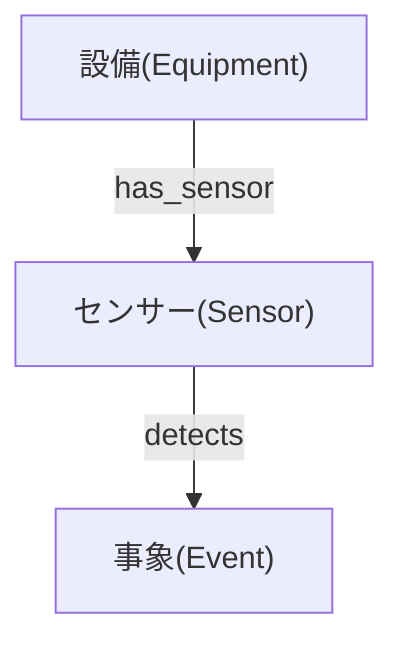
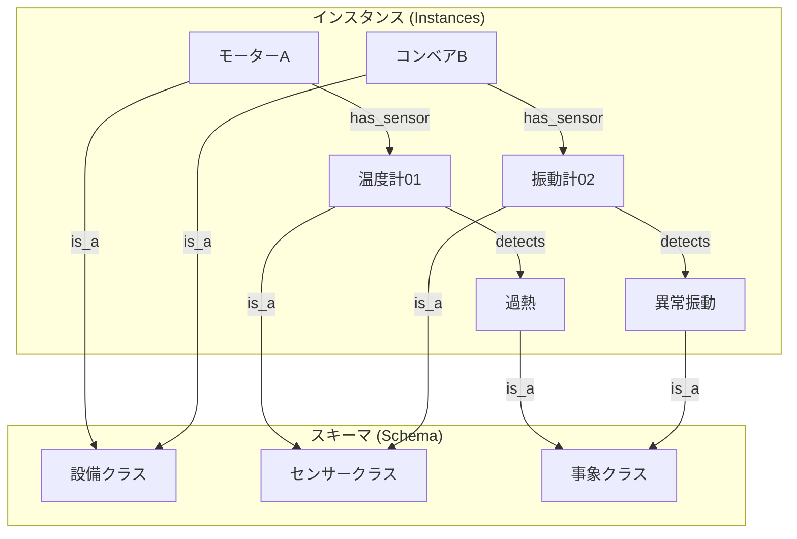

# オントロジーとセマンティックレイヤー (Ontology and Semantic Layer)

## 概要
オントロジーとナレッジグラフは、データを単なる「表」ではなく「意味を持ったネットワーク」として扱うための技術です。特に複雑な関係性を持つデータ（例えば、工場の設備、センサー、過去の故障履歴など）をAIに正確に理解させる上で、中核的な役割を果たします。

## 専門家の知見の集約
- **暗黙知の形式知化**: 設備やシステムの知識、業務ルール、トラブルシューティング手順といった暗黙知を形式知に変換し、AIエージェントが利用できるようにします。
- **共通の知識基盤**: 一度設計したオントロジーは、組織内で共通の「知識の基盤（ベース）」として機能し、誰がアクセスしても同じ解釈でデータを扱えるようになります。

---

## 一連の流れ
オントロジーやナレッジグラフの分野は、「学術的な概念（考え方）」と「ソフトウェアエンジニアリングの実装（具体的なツールや規格）」が混ざって語られることが多いため、混乱しやすいポイントです。
ここでは、「概念（What：どういう構造にするか）」と、それをシステム上で動かすための「実装（How：どの規格やツールを使うか）」を明確に切り分けて整理します。

### 概念と実装の対比マップ

| 層（レイヤー） | 【概念】考え方・モデル | 【実装】具体的な規格・言語・製品 |
| :--- | :--- | :--- |
| **1. データの形** | トリプル、プロパティグラフ | RDF (W3C規格) |
| **2. 知識の設計図** | タクソノミー、オントロジー | OWL (W3C規格の言語) |
| **3. 知識の集合体** | ナレッジグラフ | Neo4j, Amazon Neptune (製品) |
| **4. 検索と操作** | グラフ探索、マルチホップ推論 | SPARQL, Cypher (クエリ言語) |
| **5. AI連携** | ハルシネーション抑制、外部記憶 | GraphRAG (システム構成の手法) |

---

### 各レイヤーの詳細

#### 1 & 2. 知識の設計と表現（ルール作り）
この層は「世界をどうやってデータ化するか」というモデリングの層です。
- **【概念】オントロジー**: 「機器にはセンサーがついている」「エラーはセンサーが検知する」というルールの考え方です。
- **【実装】OWL (Web Ontology Language) / RDF**: オントロジーという考え方を、コンピュータが読み込めるXMLやJSON形式のファイルとして記述するための標準規格（文法）です。W3CというWebの標準化団体が定めています。

#### 3. データの保存場所（データベース）
設計図（オントロジー）に合わせて、実際のデータ（ナレッジグラフ）をどこにどう保存するかという層です。
- **【概念】グラフデータベース / プロパティグラフ**: リレーショナルデータベース（行と列の表）ではなく、点と線（ノードとエッジ）でデータを保存するデータベースの種類（ジャンル）を指します。
- **【実装】Neo4j / Amazon Neptune / GraphDB**: グラフデータベースという概念を、実際に動くソフトウェアとして開発した製品名です。（※リレーショナルデータベースという概念に対する、MySQLやPostgreSQLと同じ関係です）。

#### 4. データの取り出し方（クエリ）
保存されたデータから、「特定の条件に合うつながり」を探し出す層です。
- **【概念】グラフ探索 / マルチホップ推論**: 「AからBを辿り、さらにCを見つける」という探索の振る舞いやアルゴリズムのことです。
- **【実装】Cypher / SPARQL / Gremlin**: グラフ探索を行うためにエンジニアが実際にキーボードで打ち込むプログラミング言語（クエリ言語）です（※SQLのグラフ版）。現在、プロパティグラフ製品では**Cypher**が事実上の業界標準になりつつあります。

#### 5. AIへの応用
構築したナレッジグラフをLLMとどう連携させるかという層です。
- **【概念】AIの外部記憶**: LLMが知らない社内情報や、正確な事実関係を外部から与えるという目的です。
- **【実装】GraphRAG**: 「ユーザーの質問を受け取る → LangChainなどのライブラリを使ってCypherを生成する → Neo4jに投げて結果を得る → LLMが文章にする」という、具体的なシステムアーキテクチャ（設計手法）の名前です。

#### まとめ
「**オントロジー（概念）**を元に設計し、**Neo4j（実装）**というグラフデータベースにデータを投入して**ナレッジグラフ（概念）**を作り上げ、**Cypher（実装）**という言語で検索して、**GraphRAG（実装手法）**としてLLMに繋ぐ」というのが、一連の流れになります。

---

### セマンティック層（Layer 3）とアプリケーション層（Layer 4）の違い

混乱しやすいポイントのため、役割を明確に切り分けて整理します。

| | Layer 3：セマンティック層 | Layer 4：アプリケーション層 |
| :--- | :--- | :--- |
| **役割** | **翻訳者・仲介役** | **利用者・消費者** |
| **何をするか** | 人間/AIの"意図・問い"を、DB操作（クエリ・グラフ探索）に変換する | セマンティック層を呼び出して、実際に価値を生み出す |
| **具体例** | `find_affected_machine()` 関数、CypherクエリのAPI、音声コマンドの解釈部分 | AIエージェント、ロボット制御システム、音声アシスタント全体 |
| **家のアナロジー** | 家の「API窓口」（照明スイッチ、音声コマンド受付口） | 住人・AIロボット（API窓口を使って快適に生活する側） |

> [!NOTE]
> **音声アシスタント（Alexa等）について**：「言葉を解釈してDB操作に変換する部分」はLayer 3、「デバイス・サービス全体」はLayer 4に相当します。音声アシスタントはLayer 3とLayer 4にまたがる存在であるため、どちらか一方の例えとして使うと境界が曖昧になります。

**コードで見る最も正確な理解：**

```python
# ← Layer 3（セマンティック層）：複雑なグラフ探索を隠蔽する"翻訳関数"
def find_affected_machine(graph, event_name):
    sensors = [src for src, dst, data in graph.in_edges(event_name, data=True)
               if data.get("relation") == "DETECTS"]
    affected_machines = []
    for sensor in sensors:
        machines = [src for src, dst, data in graph.in_edges(sensor, data=True)
                    if data.get("relation") == "HAS_SENSOR"]
        affected_machines.extend(machines)
    return affected_machines

# ← Layer 4（アプリケーション層）：Layer 3を呼び出すだけで答えを得る"利用者"
# AIエージェントは裏側のグラフ構造（Cypherの仕様等）を知らなくてよい
result = find_affected_machine(G, "Error_Overheat_001")
```

---

## 概念と周辺技術の網羅的関係図
技術スタックは「設計（モデリング）」「実データ（インスタンス）」「保存・操作（インフラ）」「応用（AI連携）」の4層で捉えると分かりやすいです。

### 1. 知識のモデリング（設計図）
- **タクソノミー (Taxonomy)**: 概念の階層的な分類のみを定義（例：「モーター」は「駆動部品」のサブクラス）。
- **オントロジー (Ontology)**: タクソノミーに加え、概念間の複雑な関係性や制約を厳密に定義するスキーマ（例：「温度センサー」は「モーター」に *設置される* 、「異常」は「センサー」によって *検知される* ）。

### 2. データの実体（インスタンス）
- **ナレッジグラフ (Knowledge Graph)**: オントロジーという「骨組み」に対して、現実世界の具体的なデータ（例：「モーターA」「温度センサーB」「2025年6月の過熱エラー」）を流し込み、ノードとエッジで繋いだ巨大な知識ベース。

### 3. データの表現とインフラ
- **RDF (Resource Description Framework)**: データを「主語 - 述語 - 目的語」のトリプルで表現するセマンティックWebの標準規格。
- **Property Graph (プロパティグラフ)**: ノードやエッジ自体にキー・バリュー型の属性を持たせるモデル。実務での取り回しが良く、現在の主流。
- **グラフデータベース**: ノードとエッジの保存・探索に特化したDB（Neo4j, Amazon Neptuneなど）。
- **クエリ言語**: グラフを検索・操作する言語（RDFには **SPARQL**、Neo4jなどには **Cypher** が使われます）。

### 4. AI・システムへの応用
- **GraphRAG**: ナレッジグラフとLLMを組み合わせた検索拡張生成。

---

## オントロジーVSナレッジグラフ
この2つの最大の違いは**「抽象的なルール（型）」**か**「具体的な事実（データ）」**か、という点です。
オントロジーをしっかり設計しておくことで、「特定の機器でエラーが起きたとき、同じ構成部品を持つ別の機器をグラフから辿って特定する」といった論理推論が可能になります。

| 概念 | 役割 | 製造業データでの例 |
| :--- | :--- | :--- |
| **オントロジー** | データベースの「スキーマ」に相当。クラスや関係性のルールを定義する。 | `[機器]` は `[センサー]` を持つ。`[センサー]` は `[時系列データ]` を生成する。 |
| **ナレッジグラフ** | データベースの「中身のレコード」に相当。実際のエンティティ同士の繋がり。 | `[プレス機1号]` は `[振動センサーX]` を持つ。`[振動センサーX]` は `[2025-06-13の異常値]` を生成した。 |

### 概念図：オントロジー（スキーマ/ルール）


### 概念図：インスタンスとスキーマの関係


> [!TIP]
> **Key insight**: 分析エージェントなどが自律的に動く際、背後にこのグラフ構造があれば、「モーターAの異常原因を探るために、繋がっている温度センサーの履歴を辿る」といった多段的な推論（Multi-hop reasoning）が容易になります。

---

## ナレッジグラフとLLMの融合：GraphRAG
現在、ナレッジグラフが最も注目を集めている領域が **GraphRAG (Graph Retrieval-Augmented Generation)** です。

通常のRAG（ベクトルデータベースを用いた検索）は、意味的な類似度でテキストの断片を拾ってくるため、「AとBはどういう関係か？」「システム全体の構成を要約して」といった、情報が複数ドキュメントにまたがる構造的な問いに弱いです。

GraphRAGは、ドキュメントから事前にエンティティと関係性を抽出してナレッジグラフを構築します。ユーザーが質問すると、LLMはグラフ上の関連ノードを辿りながら（グラフ探索）、正確な事実関係や繋がりをコンテキストとして取得します。

これにより、LLMのハルシネーション（幻覚）を強力に抑え込み、自律型AIエージェントの外部記憶装置として非常に高い精度を発揮します。

---

## 用語集

| カテゴリー | 用語 | 意味 |
| :--- | :--- | :--- |
| **概念・設計** | タクソノミー (Taxonomy) | 「上位・下位」のツリー状の階層構造だけで概念を分類した体系。 |
| **概念・設計** | オントロジー (Ontology) | 階層構造に加え、概念間の複雑な関係性や制約を厳密に定義したスキーマ（設計図）。 |
| **概念・設計** | ナレッジグラフ (Knowledge Graph) | 実世界の具体的なデータを、オントロジーなどの規則に従って結びつけた巨大な知識のネットワーク。 |
| **概念・設計** | エンティティ (Entity) | 現実世界に存在する具体的な対象物や事象（例：プレス機1号、温度センサー、過熱エラー）。 |
| **概念・設計** | ノード / 頂点 (Node) | グラフ構造における「点」。具体的なエンティティやデータの実体を表す。 |
| **概念・設計** | エッジ / リンク (Edge) | ノード同士の結びつきや関係性を表す「線」（例：「〜に設置されている」「〜が原因である」）。 |
| **データモデル** | トリプル (Triple) | 情報を「主語(Subject)・述語(Predicate)・目的語(Object)」の3要素で表現する基本形式。 |
| **データモデル** | プロパティグラフ (Property Graph) | ノードやエッジ自体にキー・バリュー型の属性（プロパティ）を格納できるグラフモデル。現在の実務で主流。 |
| **データモデル** | RDF (Resource Description Framework) | Web上で情報をトリプル形式で記述し、機械が処理できるようにするためのW3C標準データモデル。 |
| **データモデル** | OWL (Web Ontology Language) | RDFを拡張し、クラス間の複雑な推論や高度な制約を記述できる強力なオントロジー言語。 |
| **データベース** | グラフデータベース (Graph DB) | ネットワーク構造（ノードとエッジ）をそのまま保存・高速探索できる専用のデータベース。 |
| **データベース** | SPARQL (スパルクル) | セマンティックWeb（RDF形式のデータ）を検索・操作するためのW3C標準のグラフクエリ言語。 |
| **データベース** | Cypher (サイファー) | プロパティグラフ（主にNeo4jなど）の検索・操作に特化した、直感的に記述できるクエリ言語。 |
| **データベース** | Gremlin (グレムリン) | グラフ上を「歩き回る」ように探索処理を記述できる、プログラマティックなグラフ巡回言語。 |
| **AI・LLM連携** | GraphRAG | ナレッジグラフを検索基盤として用い、LLMの回答精度向上やハルシネーション抑制を図る技術。 |
| **AI・LLM連携** | マルチホップ推論 (Multi-hop Reasoning) | 一度の検索では分からない情報を、グラフのリンクを複数回辿ることで導き出す推論プロセス。 |
| **AI・LLM連携** | ナレッジ抽出 (Knowledge Extraction) | テキスト（マニュアルやログなど）からエンティティと関係性を自動で抜き出し、グラフ化する処理。 |