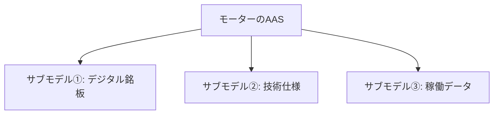

## 最初の疑問
- AASのシェルの言葉はどこから来ていますか？linuxのシェルのような、カーネルを包むもの、といった概念とはまた異なりますか？
  - 結論から言うと、AAS（アセット管理シェル）の「シェル」という言葉は、Linuxのシェルと根本的な概念がまったく同じです。むしろ、その「中身を包み込んで外部との仲介役になる」というIT・工学のデザインパターン（カプセル化）から着想を得て名付けられています。


- Linuxのシェル
  - 包まれている核（コア）: カーネル（OSの心臓部、ハードウェアを直接制御する複雑なプログラム）
  - シェルの役割: カーネルの生の複雑さを隠し、ユーザーやアプリケーションに対して「コマンド」という共通のインターフェースを提供する。

- AAS（アセット管理シェル）
  - 包まれている核（コア）: アセット（製造装置、ロボット、部品、あるいはソフトウェアや図面データそのもの）
  - シェルの役割: 各アセットごとにバラバラな通信プロトコルやデータ形式（固有の複雑さ）を隠し、デジタル空間（他のシステムやAIなど）に対して「標準化されたデータモデル（API）」を提供する。


- AASのシェルをひと言で表すと
  - AASのシェルは、現実世界にあるモノ（アセット）が、デジタル空間（インダストリー4.0の世界）に安全に参加するための「防護服であり、同時通訳インカム」のようなものです。
  - 工場内にある古いプレス機も、最新の溶接ロボットも、そのままではお互いに会話できません。しかし、それぞれを「AASという共通の殻」で包んであげることで、外部からは「同じルール（API）で情報を取り出せるデジタルツイン」として扱えるようになります。


## サブモデル（Submodel）とは

- AAS（アセット管理シェル）における**サブモデル（Submodel）**とは、アセット（機器やモノ）が持つ膨大な情報の中から、特定の「テーマ」や「観点」ごとにデータをひとまとめにした情報のコンテナ（容器）のことです。
- アセット管理シェルという「殻」の中身は、このサブモデルが複数集まることで構成されています。



### 1. なぜサブモデルに分けるのか？
- 例えば、1台の産業用ロボット（アセット）をデジタル空間で表現しようとすると、必要な情報は多岐にわたります。
  - **設計者**が知りたい情報：3D CADデータ、寸法、重量など
  - **購買担当者**が知りたい情報：価格、メーカー名、型番、シリアル番号など
  - **保全エンジニア**が知りたい情報：稼働時間、エラー履歴、現在のモーター温度など

- これらを1つの巨大なデータファイルに詰め込んでしまうと、システム間の連携やアクセス権の管理が非常に複雑になります。
- そこで、「**関心事の分離（Separation of Concerns）**」の思想に基づき、テーマごとにバケツを分けたのがサブモデルです。これにより、必要な役割を持つシステムが必要な情報だけにアクセスしやすくなります。

### 2. サブモデルの具体的なデータ構造
- サブモデルの内部は、単なるテキストデータの集まりではなく、機械（AIやITシステム）が自動で意味を理解できるように、高度に構造化されています。
- 主要な構成要素は以下の4つです。

| 構成要素 | 役割 | 概要・具体例 |
| :--- | :--- | :--- |
| **`idShort`** | システム内の識別名 | 人間やプログラムが判別しやすい短い名前（例: `MaxRotationSpeed`） |
| **`semanticId`** | 意味のグローバル定義 | そのデータが「何を意味するか」を指し示す識別子。ここで先述の [IRIやIRDI](file:///c:/Users/kaida/Documents/git_dev/public-note/building-OS/10_IRI%E3%81%A8IRDI.md) が使われます。 |
| **`value`** | 実際のデータ値 | 静的な値（例: `3000`）や、リアルタイムの時系列データソースへの参照など |
| **`unit`** | 単位 | データの単位（例: `1/min` や `rpm`） |

#### 💡 `semanticId` の重要性
特に重要なのが **`semanticId`** です。世界中のどのシステムが見ても、`semanticId` に記述された国際標準（ECLASSやIEC CDDのIRDIなど）を参照すれば、「これは『最高回転速度』のことを言っているんだな」と、表記の揺れ（`MaxSpeed` や `Maximum RPM` など）に影響されることなく、システム側で自動的に正しく解釈できるようになっています。

### 3. 具体例：モーターのAAS構造とJSON表現
- AAS構造イメージ
```text
[ モーターのアセット管理シェル (AAS) ]
 │
 ├── サブモデル①: "Digital Nameplate" (デジタル銘板)
 │    ├── メーカー名: "XYZ Motors" (SemanticId: 0173-1#02-AAO677#002)
 │    └── シリアル番号: "SN-987654"
 │
 ├── サブモデル②: "Technical Data" (技術仕様)
 │    ├── 定格電圧: 400V
 │    └── 最高回転速度: 3000 rpm (SemanticId: 0173-1#02-BAF053#008)
 │
 └── サブモデル③: "Operational Data" (稼働データ)
      ├── 現在の電流値: 4.2 A (リアルタイム通信のエンドポイント)
      └── 異常検知アラート: "Normal"
```

- データのJSON表現
  - これを実際のデータ形式（AASの標準仕様であるJSON）に落とし込むと、以下のような構造になります。
```json
{
  "idShort": "TechnicalData",
  "id": "https://example.com/submodels/motor123/technical_data",
  "submodelElements": [
    {
      "modelType": "Property",
      "idShort": "MaxRotationSpeed",
      "semanticId": {
        "type": "ExternalReference",
        "keys": [
          {
            "type": "GlobalReference",
            "value": "0173-1#02-BAF053#008" 
          }
        ]
      },
      "valueType": "xs:integer",
      "value": "3000"
    }
  ]
}
```

> [!NOTE]
> `value` の上部にある `semanticId` の中に、ECLASSの規格である IRDI（`0173-1#02-BAF053#008`）が埋め込まれているのが分かります。

### 4. サブモデルの「標準化」

サブモデルのテーマ（属性の並び順や名前）が企業ごとにバラバラだったら、結局データ連携はスムーズにいきません。
そのため、インダストリー4.0を推進する団体（**IDTA：Industrial Digital Twin Association**）などが、業界共通で使える**サブモデルテンプレート（Submodel Template）**を標準化して公開しています。

* **Digital Nameplate（デジタル銘板）**:
  すべての製品が持つべき基本情報（メーカー、製造国、法規マークなど）の標準。
* **Carbon Footprint（カーボンフットプリント）**:
  製品の製造・輸送にかかったCO2排出量を記載する標準。
* **Contact Information（連絡先情報）**:
  メーカーのサポート窓口や問い合わせ先を記載する標準。

これら標準テンプレートの枠組み（IRIで識別される）に従ってサブモデルを作るだけで、サプライチェーン上の異なる企業間でも、お互いのシステムがデータをノーコードで自動読込・自動処理できるようになります。


## AASXとは
- AASのデータ（モデルやドキュメントなど）を1つにまとめたファイルを「AASXパッケージ」と呼びます。(ファイルコンテナ形式)
- 「AAS」と「AASX」の違い
  - AAS: 概念・仕様・情報の構造（「管理シェル」という考え方そのもの）
  - AASX: それを物理的に保存するための「入れ物（フォーマット）」
- なぜAASXが必要なのか？（AASXの正体）
  - AASは、単なるテキスト情報だけではなく、関連するファイル（PDFの取扱説明書、3D CADデータ、証明書の画像など）を大量に抱えることになります。
  - これらをバラバラに送ると整合性が取れなくなるため、Open Packaging Conventions (OPC) という技術を使って、一つのパッケージに封じ込めたものが「.aasx」ファイルです。

### AASXの構成
- AASXファイルの中身を開くと、論理的には以下のような構造になっています。

1. AASの記述（メタデータ）:
   - 管理シェル本体、サブモデルの構造、プロパティの定義などが記述されたXMLまたはJSONファイル。

2. 実体ファイル（アセット関連データ）:
   - /manuals/robot_manual.pdf
   - /cad/base_structure.step
   - /certificates/iso_9001.png
   - これらはパッケージ内のパス（相対パス）で管理されており、AASのメタデータ内から「このプロパティの根拠はこのファイルを参照」という形でリンクされています。

### AASXのまとめ
- なぜこれが強力なのか
  - AASXファイルを一つ相手に渡せば、「その機械の全情報（仕様データ＋取扱説明書＋証明書＋CAD図面）」が、一括で確実に伝わるからです。


## AASを試してみる(Swagger)
### リンク
- [Technology - IDTA](https://industrialdigitaltwin.org/en/technology)
- [Swagger UI](https://v3-2.admin-shell-io.com/swagger/index.html)

### 概要
- このページは、Asset Administration Shell (AAS / 資産管理シェル) のリポジトリ機能を操作するためのWeb API仕様書（Swagger UI）です。
- 開発における主な用途として、このページは、主にスマートファクトリーやデジタルツインのシステムを開発するエンジニアが利用します。
- 画面上の各項目（GET, POST, PUT, DELETE）をクリックして展開すると、「要求するリクエストデータの形式（JSON）」や「サーバーから返ってくるレスポンスの形式」を詳しく確認でき、この画面上から実際にAPIのテスト送信を行うことも可能です。

### 主なAPIカテゴリ
1. AASXFileServerAPIApi（パッケージ管理）
   - AASのデータ（モデルやドキュメントなど）を1つにまとめたファイルを「AASXパッケージ」と呼びます。このAPIでは、サーバー上にあるAASXパッケージのアップロード、取得、更新、削除を管理します。
     - GET /packages : 利用可能なAASXパッケージの一覧を取得
     - POST /packages : 新しいAASXパッケージをサーバーに作成

2. AssetAdministrationShellRegistryAPIApi（レジストリ・検索）
   - どのAASがどこに存在するのかを登録・検索（ルックアップ）するための機能です。
     - GET /shell-descriptors : 登録されているすべてのAAS記述子（ディスクリプタ）を取得
     - GET /lookup/shells : 特定の資産リンクから、対応するAASのIDを検索

3. AssetAdministrationShellRepositoryAPIApi（AASコア操作）
   - AASそのものや、その中身を構成する「Submodel（サブモデル：特定の機能や性質ごとのデータ群）」、および「SubmodelElement（具体的なデータ項目）」を詳細に操作するためのAPIです。
     - GET /shells : すべてのAASを取得
     - GET /shells/{aasIdentifier}/submodels/{submodelIdentifier} : 特定のAASに含まれる特定のサブモデルを取得
     - POST /invoke : 定義された「Operation（関数や処理）」を同期または非同期で実行・呼び出す

4. SubmodelRepositoryAPIApi（サブモデル個別の管理）
   - AAS本体とは独立して、サブモデル（特性、仕様、時系列データなどのまとまり）単体を直接管理・操作するためのAPI群です。


### 利用例
- これらのAPIを組み合わせることで、「マシンの状態を監視する（GET）」「新しい設備を追加する（POST）」「マシンに命令を下す（POST /invoke）」といった、スマートファクトリーの基盤となるシステム連携がすべてHTTP通信経由で実現できるようになっています。

1. 工場に新しい設備（ロボットアームなど）を導入したとき
   - 背景と目的
     - 新しく導入した物理資産のデジタルツイン（AAS）の構成情報を、工場の管理システムに登録・紐付ける場面です。
   - 📊 対象のAPI
     - POST /shell-descriptors （AssetAdministrationShellRegistryAPIApi）
     - POST /shells （AssetAdministrationShellRepositoryAPIApi）
   - 💡 ユースケース
     - メーカーから納品されたロボットアームのデジタルデータ（AAS情報）を、自社の工場管理システム（MESやERP）が認識できるようにサーバーへ登録します。
   - 🔄 利用例
     - 登録: 管理システムから POST /shells を呼び出し、ロボットアームのシリアル番号や基本仕様（メーカー名、型番など）を含んだAASデータを登録します。
     - 検索用リンクの作成: POST /shell-descriptors を使い、「このロボットアームのデータは、サーバーのこのURL（エンドポイント）にあります」という案内所（レジストリ）用のインデックス情報を登録します。
     - 効果: これにより、工場の他のシステムが「シリアル番号：XYZ」で検索したときに、即座にそのロボットの情報にアクセスできるようになります。 

2. 稼働中の設備の「現在の温度」や「異常アラート」を取得したいとき
     - 背景と目的
       - 監視画面（ダッシュボード）や保全システムが、特定の設備のリアルタイムな状態変化や仕様を読み取る場面です。
     - 📊 対象のAPI
       - GET /shells/{aasIdentifier}/submodels/{submodelIdentifier}/submodel-elements/{idShortPath}
     - 💡 ユースケース
       - 設備の「稼働ステータス」や「センサー値」は、AASの中の Submodel（サブモデル） という単位で小分けに管理されています。メンテナンス担当者が、特定のモーターの「現在の温度」のデータだけをピンポイントで取得して画面に表示させます。
     - 🔄 利用例
       - リクエスト: 
         - aasIdentifier ＝ "robot_arm_01"（ロボットのID）
         - submodelIdentifier ＝ "OperationalData"（稼働データサブモデルのID）
         - idShortPath ＝ "MotorTemperature"（モーター温度という項目までのパス）
       - 返ってくるデータ:
         -  {"value": "72.5", "unit": "°C"} のような現在の温度データ。
       - 効果:
         -  画面に「72.5°C」とリアルタイム表示したり、80°Cを超えたらアラートを出すといった仕組みが作れます。

3. 生産ラインの製品に応じて、設備のパラメータ（段取り）を変更したいとき
     - 背景と目的
       - 上位の生産管理システムから、製造ラインのロボットに対して「次はこの製品が流れてくるから、設定をAモードに変えて」と命令を送る場面です。
     - 📊 対象のAPI
       - POST /shells/{aasIdentifier}/submodels/{submodelIdentifier}/submodel-elements/{idShortPath}/invoke
     - 💡 ユースケース
       - AASでは、単なるデータの読み書きだけでなく、機器に対して特定の処理を実行させる Operation（関数・プログラム） を定義できます。システムの自動化（段取り替えの自動化）で頻繁に使用されます。
     - 🔄 利用例
       - 命令の発行: 生産管理システムが上記の .../invoke APIを呼び出します。
       - リクエストボディ（パラメーター）:
       ```json
       {
       "inputArguments": [
           { "name": "ProductType", "value": "Model_B" }
       ]
       }
       ```
       - 実際の動き: ロボットアームの制御PCがこのAPI要求を受け取り、内部のプログラムを「Model_B用」に自動で切り替えます。
       - 効果: 人手を介さずに、多品種少量生産のラインを自動でコントロールできるようになります。

