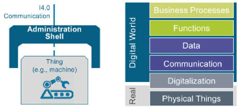
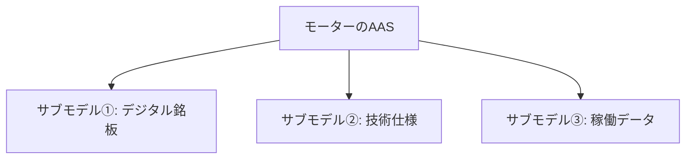

## 最初の疑問
- AASのシェルの言葉はどこから来ていますか？linuxのシェルのような、カーネルを包むもの、といった概念とはまた異なりますか？
  - 結論から言うと、AAS（アセット管理シェル）の「シェル」という言葉は、Linuxのシェルと根本的な概念がまったく同じです。むしろ、その「中身を包み込んで外部との仲介役になる」というIT・工学のデザインパターン（カプセル化）から着想を得て名付けられています。



- Linuxのシェル
  - 包まれている核（コア）: カーネル（OSの心臓部、ハードウェアを直接制御する複雑なプログラム）
  - シェルの役割: カーネルの生の複雑さを隠し、ユーザーやアプリケーションに対して「コマンド」という共通のインターフェースを提供する。

- AAS（アセット管理シェル）
  - 包まれている核（コア）: アセット（製造装置、ロボット、部品、あるいはソフトウェアや図面データそのもの）
  - シェルの役割: 各アセットごとにバラバラな通信プロトコルやデータ形式（固有の複雑さ）を隠し、デジタル空間（他のシステムやAIなど）に対して「標準化されたデータモデル（API）」を提供する。


- AASのシェルをひと言で表すと
  - AASのシェルは、現実世界にあるモノ（アセット）が、デジタル空間（インダストリー4.0の世界）に安全に参加するための「防護服であり、同時通訳インカム」のようなものです。
  - 工場内にある古いプレス機も、最新の溶接ロボットも、そのままではお互いに会話できません。しかし、それぞれを「AASという共通の殻」で包んであげることで、外部からは「同じルール（API）で情報を取り出せるデジタルツイン」として扱えるようになります。


## サブモデル（Submodel）とは

- AAS（アセット管理シェル）における**サブモデル（Submodel）**とは、アセット（機器やモノ）が持つ膨大な情報の中から、特定の「テーマ」や「観点」ごとにデータをひとまとめにした情報のコンテナ（容器）のことです。
- アセット管理シェルという「殻」の中身は、このサブモデルが複数集まることで構成されています。



---

### 1. なぜサブモデルに分けるのか？

- 例えば、1台の産業用ロボット（アセット）をデジタル空間で表現しようとすると、必要な情報は多岐にわたります。
  - **設計者**が知りたい情報：3D CADデータ、寸法、重量など
  - **購買担当者**が知りたい情報：価格、メーカー名、型番、シリアル番号など
  - **保全エンジニア**が知りたい情報：稼働時間、エラー履歴、現在のモーター温度など

- これらを1つの巨大なデータファイルに詰め込んでしまうと、システム間の連携やアクセス権の管理が非常に複雑になります。
- そこで、「**関心事の分離（Separation of Concerns）**」の思想に基づき、テーマごとにバケツを分けたのがサブモデルです。これにより、必要な役割を持つシステムが必要な情報だけにアクセスしやすくなります。

---

### 2. サブモデルの具体的なデータ構造

- サブモデルの内部は、単なるテキストデータの集まりではなく、機械（AIやITシステム）が自動で意味を理解できるように、高度に構造化されています。
- 主要な構成要素は以下の4つです。

| 構成要素 | 役割 | 概要・具体例 |
| :--- | :--- | :--- |
| **`idShort`** | システム内の識別名 | 人間やプログラムが判別しやすい短い名前（例: `MaxRotationSpeed`） |
| **`semanticId`** | 意味のグローバル定義 | そのデータが「何を意味するか」を指し示す識別子。ここで先述の [IRIやIRDI](file:///c:/Users/kaida/Documents/git_dev/public-note/building-OS/10_IRI%E3%81%A8IRDI.md) が使われます。 |
| **`value`** | 実際のデータ値 | 静的な値（例: `3000`）や、リアルタイムの時系列データソースへの参照など |
| **`unit`** | 単位 | データの単位（例: `1/min` や `rpm`） |

#### 💡 `semanticId` の重要性
特に重要なのが **`semanticId`** です。世界中のどのシステムが見ても、`semanticId` に記述された国際標準（ECLASSやIEC CDDのIRDIなど）を参照すれば、「これは『最高回転速度』のことを言っているんだな」と、表記の揺れ（`MaxSpeed` や `Maximum RPM` など）に影響されることなく、システム側で自動的に正しく解釈できるようになっています。

---

### 3. 具体例：モーターのAAS構造とJSON表現

#### AAS構造イメージ

```text
[ モーターのアセット管理シェル (AAS) ]
 │
 ├── サブモデル①: "Digital Nameplate" (デジタル銘板)
 │    ├── メーカー名: "XYZ Motors" (SemanticId: 0173-1#02-AAO677#002)
 │    └── シリアル番号: "SN-987654"
 │
 ├── サブモデル②: "Technical Data" (技術仕様)
 │    ├── 定格電圧: 400V
 │    └── 最高回転速度: 3000 rpm (SemanticId: 0173-1#02-BAF053#008)
 │
 └── サブモデル③: "Operational Data" (稼働データ)
      ├── 現在の電流値: 4.2 A (リアルタイム通信のエンドポイント)
      └── 異常検知アラート: "Normal"
```

#### データのJSON表現

これを実際のデータ形式（AASの標準仕様であるJSON）に落とし込むと、以下のような構造になります。

```json
{
  "idShort": "TechnicalData",
  "id": "https://example.com/submodels/motor123/technical_data",
  "submodelElements": [
    {
      "modelType": "Property",
      "idShort": "MaxRotationSpeed",
      "semanticId": {
        "type": "ExternalReference",
        "keys": [
          {
            "type": "GlobalReference",
            "value": "0173-1#02-BAF053#008" 
          }
        ]
      },
      "valueType": "xs:integer",
      "value": "3000"
    }
  ]
}
```

> [!NOTE]
> `value` の上部にある `semanticId` の中に、ECLASSの規格である IRDI（`0173-1#02-BAF053#008`）が埋め込まれているのが分かります。

---

### 4. サブモデルの「標準化」

サブモデルのテーマ（属性の並び順や名前）が企業ごとにバラバラだったら、結局データ連携はスムーズにいきません。
そのため、インダストリー4.0を推進する団体（**IDTA：Industrial Digital Twin Association**）などが、業界共通で使える**サブモデルテンプレート（Submodel Template）**を標準化して公開しています。

* **Digital Nameplate（デジタル銘板）**:
  すべての製品が持つべき基本情報（メーカー、製造国、法規マークなど）の標準。
* **Carbon Footprint（カーボンフットプリント）**:
  製品の製造・輸送にかかったCO2排出量を記載する標準。
* **Contact Information（連絡先情報）**:
  メーカーのサポート窓口や問い合わせ先を記載する標準。

これら標準テンプレートの枠組み（IRIで識別される）に従ってサブモデルを作るだけで、サプライチェーン上の異なる企業間でも、お互いのシステムがデータをノーコードで自動読込・自動処理できるようになります。
